# Assignment 5
## Part one
For the first part, Mean Curvature Motion was implemented.
| Image | MCM final | MCM animation |
|:---------:|:---------:|:---------:|
| 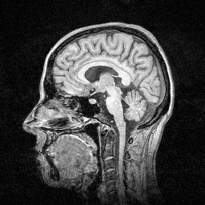 | 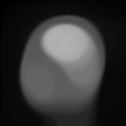 |  |
## Part two
Fro the second part, Chan Vese segmentation was implemented.
| Image | CV overlay | CV animation |
|:---------:|:---------:|:---------:|
|  | 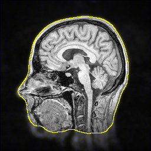 | 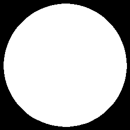

# Assignment 4
## Part one
For the first part, Coherence-enhancing anisotropic diffusion (CED) was applied to images.
| Image | CED |
|:---------:|:---------:|
|  | 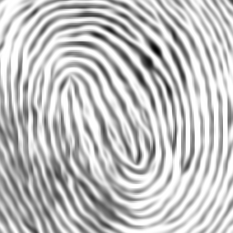 |
| 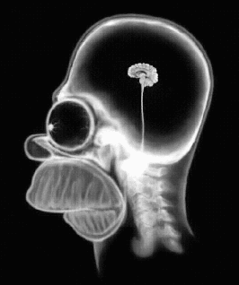 |  |
| 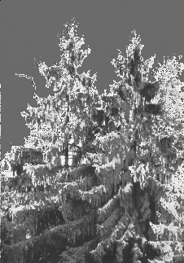 | 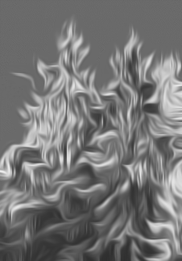 |
<!-- -->
| Image | CED 20 iterations | CED 200 iterations |
|:---------:|:---------:|:---------:|
|  |  | 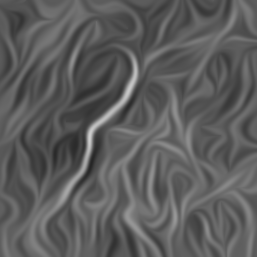 |
## Part two
For the second part, dilation and erosion operations on grascale images were implemented.
| Image | Dilation | Erosion |
|:---------:|:---------:|:---------:|
| 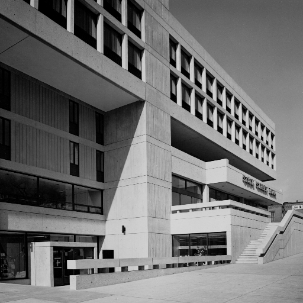 | 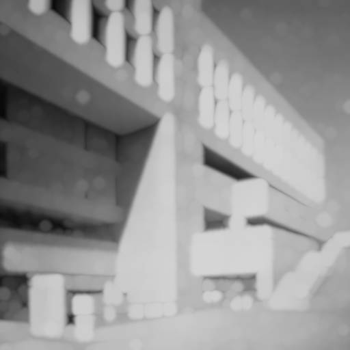 | 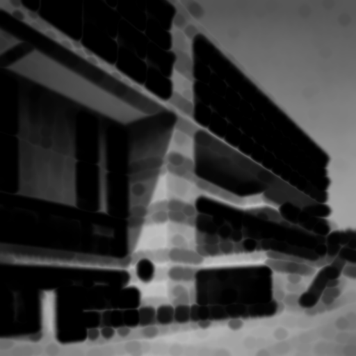 |
|  | 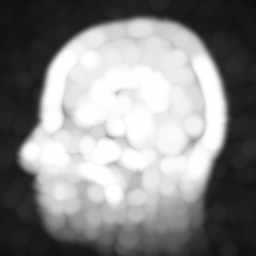 | 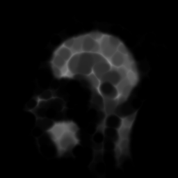 |
##
For the third part, shock filtering was implemented for grayscale and color images
| Image | Shock filter |
|:---------:|:---------:|
| 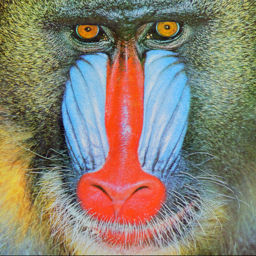 | 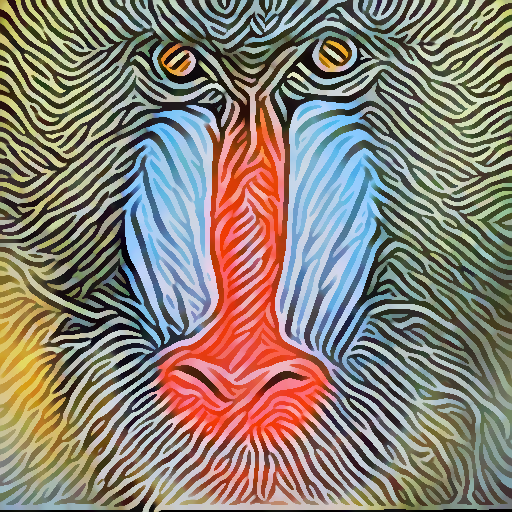 |
|  | 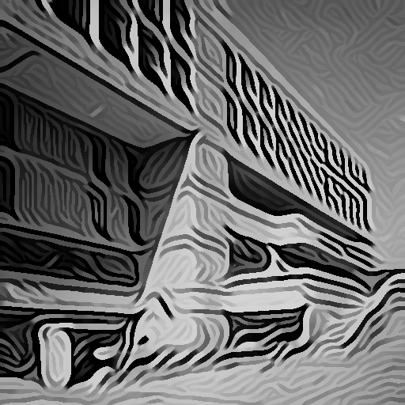 |
|  |  |
|  | 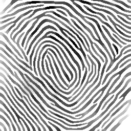 |assets/head_cv_animation.gif" alt="head cv animation" width="100"> |

# Assignment 3
For this assignment, Horn and Schunck method was used for Optical Flow Estimation between two frames.
| Frame 1 | Frame 2 |
|:---------:|:---------:|
| 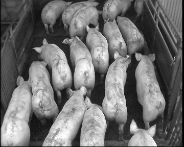 | 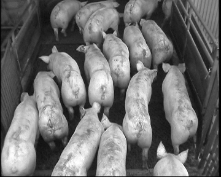 |
| Flow magnitude |
| 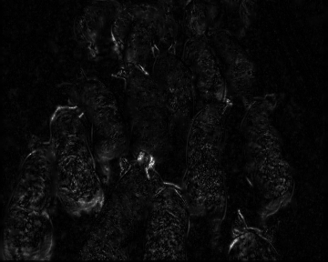 |

# Assignment 2
In this assignment, Optical Flow Estimation between two frames using the Lucas–Kanade method was performed.
| Frame 1 | Frame 2 |
|:---------:|:---------:|
| 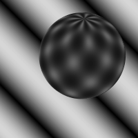 |  |
| Flow magnitude | Flow classification |
| 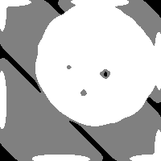 |  |

# Assignment 1
## Part one
In the first part of this assignment, gradient map of an image containing coins is approximated using finite differences:
| Original | Gradient map |
|:---------:|:---------:|
| 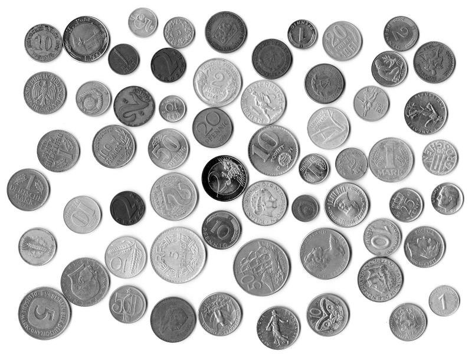 | 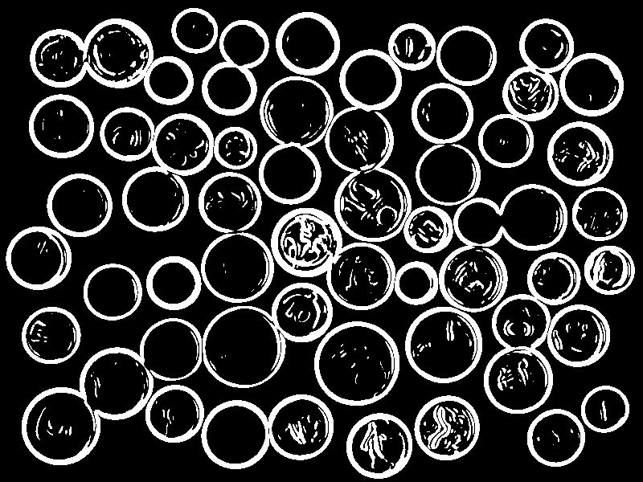 |
## Part two
In this part, the shapes of the coins are deteced using hough transfrom and the gradient map from the previous part.
| Detected shapes | Boundaries |
|:---------:|:---------:|
| 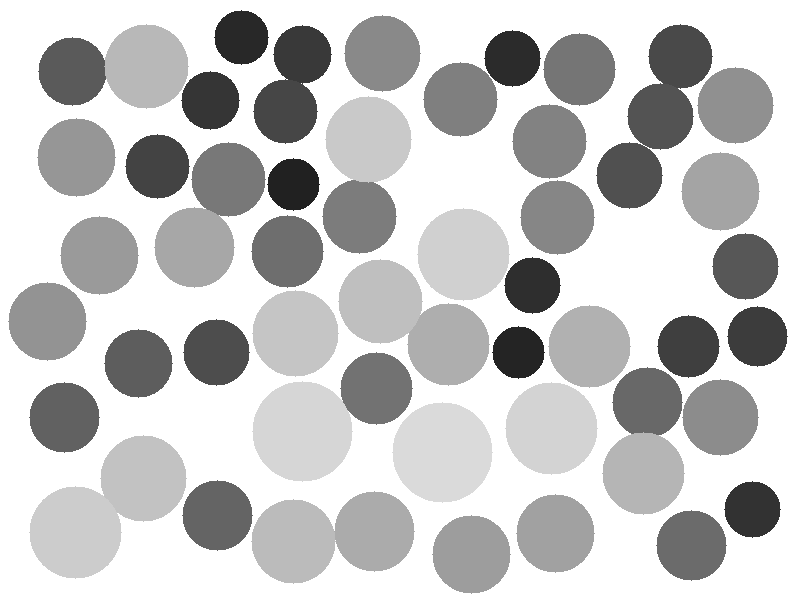 | 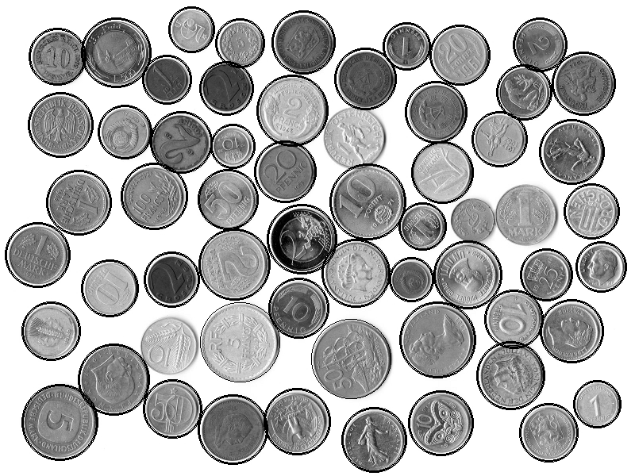 |